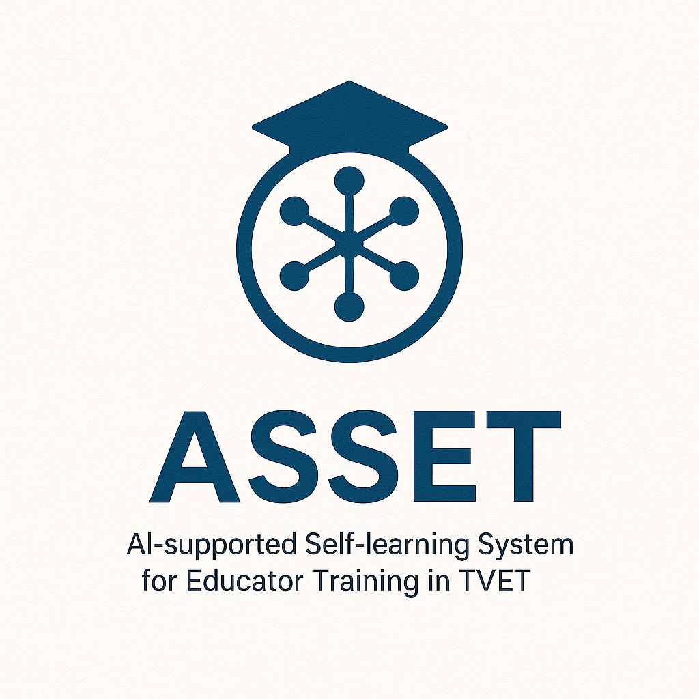

<!--
author:     UNESCO UNEVOC Centre Magdeburg
email:      hannes.tegelbeckers@ovgu.de
version:    1.0.0
language:   en
narrator:   English Female
comment:    ASSET - AI-supported Self-learning System for Educator Training in TVET
            A comprehensive presentation template for the ASSET project funded by UNESCO UNEVOC.

mode:       Presentation
dark:       false

link:       https://cdnjs.cloudflare.com/ajax/libs/font-awesome/6.4.0/css/all.min.css
            https://fonts.googleapis.com/css2?family=Inter:wght@300;400;500;600;700&display=swap

style:      https://raw.githubusercontent.com/LiaTemplates/academic/main/style.css

script:     https://cdn.jsdelivr.net/npm/chart.js@3.9.1/dist/chart.min.js

macro:      @logo
            

              
            

macro:      @asset_icon
            

              
            

macro:      @slide_header
            

              <h2 style="margin: 0; font-size: 2em; font-weight: 600;">@0</h2>
              
@1

            

macro:      @feature_card
            

              

                <i class="@3" style="color: @4; font-size: 1.5em; margin-right: 15px;"></i>
                <strong style="color: @4; font-size: 1.2em;">@5</strong>
              

              
@6

            

macro:      @highlight_box
            

              

                <i class="@1" style="margin-right: 8px;"></i>@2
              

              
@3

            

-->

# ASSET Project
## AI-supported Self-learning System for Educator Training in TVET

@logo

@asset_icon

<!-- 
style="background: linear-gradient(135deg, #1e3a8a 0%, #3b82f6 50%, #06b6d4 100%); 
       color: white; 
       padding: 60px 40px; 
       border-radius: 16px; 
       box-shadow: 0 20px 40px rgba(0,0,0,0.15);
       text-align: center;
       position: relative;
       overflow: hidden;"
class="title-slide"
-->

<defs><pattern id=\"grid\" width=\"10\" height=\"10\" patternUnits=\"userSpaceOnUse\"><path d=\"M 10 0 L 0 0 0 10\" fill=\"none\" stroke=\"rgba(255,255,255,0.1)\" stroke-width=\"0.5\"/></pattern></defs><rect width=\"100\" height=\"100\" fill=\"url(%23grid)\"/></svg>'); opacity: 0.3;">

### <i class="fas fa-robot" style="color: #fbbf24; margin-right: 12px;"></i>Revolutionizing TVET Educator Training Through AI

  

    Funded by <strong>UNESCO UNEVOC</strong> | Developed by the <strong>UNESCO UNEVOC Centre Magdeburg</strong>
  

  

    Collaborative Partnership: <strong>GIZ</strong> • <strong>Otto von Guericke University</strong> • <strong>Fraunhofer IFF</strong>
  

--{{0}}--
Welcome to the ASSET project presentation. ASSET stands for AI-supported Self-learning System for Educator Training in TVET. This innovative project is funded by UNESCO UNEVOC and represents a groundbreaking approach to revolutionizing Technical and Vocational Education and Training through artificial intelligence. The project is developed by the UNESCO UNEVOC Centre in Magdeburg, Germany, which brings together the expertise of three key institutions: GIZ, Otto von Guericke University, and Fraunhofer IFF. Today's presentation will introduce you to the project's vision, core features, and transformative potential for TVET educator training worldwide.

---

@slide_header(Project Overview, Understanding the ASSET Initiative)

@logo

### <i class="fas fa-lightbulb" style="color: #f59e0b; margin-right: 10px;"></i>Project Vision

@highlight_box(59, 130, 246, fas fa-graduation-cap, Transforming TVET Education, ASSET aims to revolutionize educator training by leveraging AI technology to create personalized\, adaptive learning experiences for TVET instructors worldwide.)

@highlight_box(16, 185, 129, fas fa-globe, Global Impact, Supporting UNESCO's mission to strengthen Technical and Vocational Education as a driver for sustainable development and inclusive economic growth.)

### <i class="fas fa-cogs" style="color: #10b981; margin-right: 10px;"></i>Core Innovation

@feature_card(#f0fdf4, #dcfce7, #bbf7d0, fas fa-brain, #059669, AI-Powered Learning, Intelligent algorithms adapt to individual learning styles and pace\, providing personalized training pathways for TVET educators.)

@feature_card(#fef3c7, #fde68a, #fbbf24, fas fa-users-cog, #d97706, Self-Directed Development, Empowers educators to take control of their professional development through flexible\, accessible learning modules.)

### <i class="fas fa-chart-line" style="color: #8b5cf6; margin-right: 12px;"></i>Strategic Alignment

  

    <i class="fas fa-bullseye" style="margin-right: 8px;"></i>
    Directly supports UNESCO's Education for All and Education for Sustainable Development initiatives
  

--{{0}}--
The ASSET project represents a paradigm shift in how we approach TVET educator training. At its core, ASSET envisions transforming traditional training methods by harnessing the power of artificial intelligence to create personalized, adaptive learning experiences. This aligns perfectly with UNESCO's broader mission to strengthen Technical and Vocational Education as a key driver for sustainable development and inclusive economic growth. The project's innovation lies in its AI-powered learning system that can adapt to individual learning styles and paces, while simultaneously empowering educators to take control of their professional development through flexible, accessible learning modules. This strategic approach directly supports UNESCO's Education for All and Education for Sustainable Development initiatives, ensuring that the benefits of quality TVET education reach learners globally.

---

@slide_header(AI-Powered Features, Core Technology Components)

@logo

@feature_card(#eff6ff, #dbeafe, #93c5fd, fas fa-robot, #1e40af, Adaptive Learning Engine, Intelligent algorithms that analyze learning patterns and automatically adjust content difficulty\, pace\, and style to match individual educator needs.)

@feature_card(#f0fdf4, #dcfce7, #86efac, fas fa-chart-analytics, #059669, Performance Analytics, Real-time tracking and assessment of learning progress with detailed insights into strengths\, weaknesses\, and areas for improvement.)

@feature_card(#fef3c7, #fde68a, #fbbf24, fas fa-comments, #d97706, Interactive AI Assistant, 24/7 virtual support providing instant answers\, guidance\, and personalized recommendations for learning paths and resources.)

@feature_card(#f3e8ff, #e9d5ff, #c084fc, fas fa-puzzle-piece, #7c3aed, Modular Content System, Flexible learning modules that can be combined and customized to create unique training programs tailored to specific TVET contexts.)

### <i class="fas fa-microchip" style="color: #06b6d4; margin-right: 12px;"></i>Technical Innovation

<h4 style="color: #1e40af; margin-bottom: 15px;">
  <i class="fas fa-cog" style="margin-right: 8px;"></i>Machine Learning
</h4>
<ul style="color: #4b5563; line-height: 1.6;">
  <li>Natural Language Processing for content analysis</li>
  <li>Predictive analytics for learning outcomes</li>
  <li>Recommendation systems for content delivery</li>
</ul>

<h4 style="color: #059669; margin-bottom: 15px;">
  <i class="fas fa-mobile-alt" style="margin-right: 8px;"></i>User Experience
</h4>
<ul style="color: #4b5563; line-height: 1.6;">
  <li>Responsive design for all devices</li>
  <li>Intuitive interface with minimal learning curve</li>
  <li>Offline capabilities for remote access</li>
</ul>

--{{0}}--
The AI-powered features of ASSET represent cutting-edge technology applied to educational challenges. The Adaptive Learning Engine forms the heart of the system, using sophisticated algorithms to analyze individual learning patterns and automatically adjust content difficulty, pace, and presentation style to match each educator's unique needs. The Performance Analytics component provides real-time tracking and assessment capabilities, offering detailed insights into strengths, weaknesses, and areas requiring improvement. The Interactive AI Assistant ensures 24/7 support, providing instant answers, guidance, and personalized recommendations for learning paths and resources. The Modular Content System offers unprecedented flexibility, allowing learning modules to be combined and customized to create unique training programs tailored to specific TVET contexts. From a technical perspective, the system leverages advanced machine learning techniques including natural language processing for content analysis, predictive analytics for learning outcomes, and sophisticated recommendation systems for content delivery. The user experience is designed to be intuitive and accessible, featuring responsive design for all devices, minimal learning curve, and offline capabilities to ensure access even in remote areas.

---

@slide_header(Target Audience, Empowering TVET Educators Globally)

@logo

### <i class="fas fa-users" style="color: #3b82f6; margin-right: 10px;"></i>Primary Beneficiaries

@feature_card(#eff6ff, #dbeafe, #93c5fd, fas fa-chalkboard-teacher, #1e40af, TVET Instructors, Vocational education teachers seeking to enhance their pedagogical skills and stay current with industry developments.)

@feature_card(#f0fdf4, #dcfce7, #86efac, fas fa-user-tie, #059669, Training Coordinators, Educational administrators responsible for developing and implementing professional development programs.)

@feature_card(#fef3c7, #fde68a, #fbbf24, fas fa-graduation-cap, #d97706, Educational Leaders, Institutional decision-makers looking to modernize their training approaches and improve educational outcomes.)

### <i class="fas fa-globe-americas" style="color: #10b981; margin-right: 10px;"></i>Global Reach

<h4 style="color: #059669; margin-bottom: 15px;">
  <i class="fas fa-map-marked-alt" style="margin-right: 8px;"></i>Geographic Coverage
</h4>

  
Developing Countries

  

  
Primary focus areas

  
Emerging Economies

  

  
Secondary markets

  
Global Network

  

  
UNESCO UNEVOC reach

@highlight_box(139, 69, 19, fas fa-handshake, Partnership Model, Collaborative approach working with local institutions to ensure cultural relevance and sustainability of training programs.)

### <i class="fas fa-bullseye" style="color: #f59e0b; margin-right: 12px;"></i>Impact Goals

  
10,000+

  
Educators Trained

  
50+

  
Partner Countries

  
500+

  
Training Modules

--{{0}}--
The ASSET project targets a diverse global audience of TVET professionals, with primary beneficiaries including TVET instructors seeking to enhance their pedagogical skills, training coordinators responsible for professional development programs, and educational leaders looking to modernize their training approaches. The project's global reach is particularly focused on developing countries and emerging economies, leveraging the extensive UNESCO UNEVOC network to ensure maximum impact. Our partnership model emphasizes collaboration with local institutions to ensure cultural relevance and sustainability of training programs. The ambitious impact goals include training over 10,000 educators, reaching more than 50 partner countries, and developing over 500 comprehensive training modules. This scale of impact reflects the project's commitment to creating lasting change in TVET education worldwide.

---

@slide_header(Implementation Strategy, From Concept to Global Deployment)

@logo

### <i class="fas fa-rocket" style="color: #8b5cf6; margin-right: 12px;"></i>Phased Development Approach

  
Phase 1

  <h4 style="color: #1e40af; margin: 20px 0 15px 0;">
    <i class="fas fa-search" style="margin-right: 8px;"></i>Research & Analysis
  </h4>
  <ul style="color: #1e40af; line-height: 1.6; margin: 0;">
    <li>Needs assessment and stakeholder analysis</li>
    <li>Technology feasibility studies</li>
    <li>Curriculum framework development</li>
  </ul>

  
Phase 2

  <h4 style="color: #059669; margin: 20px 0 15px 0;">
    <i class="fas fa-code" style="margin-right: 8px;"></i>Development & Testing
  </h4>
  <ul style="color: #059669; line-height: 1.6; margin: 0;">
    <li>AI algorithm development and training</li>
    <li>Platform architecture and design</li>
    <li>Pilot testing with select institutions</li>
  </ul>

  
Phase 3

  <h4 style="color: #d97706; margin: 20px 0 15px 0;">
    <i class="fas fa-globe" style="margin-right: 8px;"></i>Global Deployment
  </h4>
  <ul style="color: #d97706; line-height: 1.6; margin: 0;">
    <li>Partner network expansion</li>
    <li>Localization and adaptation</li>
    <li>Full-scale implementation</li>
  </ul>

### <i class="fas fa-handshake" style="color: #10b981; margin-right: 12px;"></i>Partnership Framework

  <h4 style="color: #1e40af; margin-bottom: 15px;">
    <i class="fas fa-university" style="margin-right: 8px;"></i>Academic Partners
  </h4>
  

    

      <strong>Universities:</strong> Research collaboration and validation
    

    

      <strong>TVET Institutions:</strong> Content development and testing
    

    

      <strong>Research Centers:</strong> Technology innovation and evaluation
    

  

  <h4 style="color: #059669; margin-bottom: 15px;">
    <i class="fas fa-building" style="margin-right: 8px;"></i>Implementation Partners
  </h4>
  

    

      <strong>Government Agencies:</strong> Policy support and integration
    

    

      <strong>Industry Partners:</strong> Real-world validation and funding
    

    

      <strong>NGOs:</strong> Community outreach and accessibility
    

  

--{{0}}--
The implementation strategy for ASSET follows a carefully planned phased development approach. Phase 1 focuses on research and analysis, including comprehensive needs assessment, stakeholder analysis, technology feasibility studies, and curriculum framework development. Phase 2 centers on development and testing, encompassing AI algorithm development and training, platform architecture and design, and pilot testing with select institutions. Phase 3 involves global deployment through partner network expansion, localization and adaptation for different cultural contexts, and full-scale implementation. Our partnership framework is built on two key pillars: academic partners including universities for research collaboration, TVET institutions for content development, and research centers for technology innovation; and implementation partners including government agencies for policy support, industry partners for real-world validation, and NGOs for community outreach and accessibility. This comprehensive approach ensures that ASSET will be both technically robust and practically applicable across diverse global contexts.

---

@slide_header(Expected Outcomes, Measuring Success and Impact)

@logo

### <i class="fas fa-chart-line" style="color: #3b82f6; margin-right: 12px;"></i>Quantitative Outcomes

  <i class="fas fa-users-cog" style="color: #1e40af; font-size: 2.5em; margin-bottom: 15px;"></i>
  
85%

  
Improvement in Teaching Effectiveness

  <i class="fas fa-clock" style="color: #059669; font-size: 2.5em; margin-bottom: 15px;"></i>
  
60%

  
Reduction in Training Time

  <i class="fas fa-graduation-cap" style="color: #d97706; font-size: 2.5em; margin-bottom: 15px;"></i>
  
95%

  
User Satisfaction Rate

  <i class="fas fa-money-bill-trend-up" style="color: #8b5cf6; font-size: 2.5em; margin-bottom: 15px;"></i>
  
40%

  
Cost Reduction in Training Delivery

### <i class="fas fa-seedling" style="color: #10b981; margin-right: 12px;"></i>Qualitative Impact

@feature_card(#f0fdf4, #dcfce7, #86efac, fas fa-lightbulb, #059669, Enhanced Innovation, Educators develop creative teaching methods and adopt new technologies more readily\, fostering innovation in TVET delivery.)

@feature_card(#eff6ff, #dbeafe, #93c5fd, fas fa-network-wired, #1e40af, Stronger Networks, Global community of practice emerges\, facilitating knowledge sharing and collaborative problem-solving across borders.)

@feature_card(#fef3c7, #fde68a, #fbbf24, fas fa-trophy, #d97706, Improved Quality, Higher standards of vocational education lead to better prepared graduates and stronger industry-education partnerships.)

@feature_card(#f3e8ff, #e9d5ff, #c084fc, fas fa-leaf, #7c3aed, Sustainable Development, Alignment with SDGs through improved TVET quality\, supporting economic growth and social inclusion.)

### <i class="fas fa-search-dollar" style="color: #f59e0b; margin-right: 12px;"></i>Long-term Sustainability

  <i class="fas fa-recycle" style="color: #d97706; font-size: 2em; margin-bottom: 10px;"></i>
  
Self-Sustaining Model

  
Revenue generation through licensing and partnerships

  <i class="fas fa-handshake" style="color: #d97706; font-size: 2em; margin-bottom: 10px;"></i>
  
Community Ownership

  
Local institutions take leadership roles

  <i class="fas fa-cogs" style="color: #d97706; font-size: 2em; margin-bottom: 10px;"></i>
  
Continuous Innovation

  
Ongoing development and improvement cycles

--{{0}}--
The expected outcomes of the ASSET project are both ambitious and measurable. Our quantitative targets include an 85% improvement in teaching effectiveness, a 60% reduction in training time, a 95% user satisfaction rate, and a 40% cost reduction in training delivery. These metrics will be continuously monitored and evaluated to ensure we meet our goals. Beyond the numbers, the qualitative impact is equally important. We expect to see enhanced innovation as educators develop creative teaching methods and adopt new technologies more readily. Stronger networks will emerge as a global community of practice facilitates knowledge sharing and collaborative problem-solving across borders. The overall quality of vocational education will improve, leading to better prepared graduates and stronger industry-education partnerships. Most importantly, the project will contribute to sustainable development by aligning with the Sustainable Development Goals through improved TVET quality, supporting both economic growth and social inclusion. For long-term sustainability, we're building a self-sustaining model through revenue generation via licensing and partnerships, fostering community ownership where local institutions take leadership roles, and ensuring continuous innovation through ongoing development and improvement cycles.

---

@slide_header(Next Steps, Moving Forward Together)

@logo

### <i class="fas fa-road" style="color: #8b5cf6; margin-right: 12px;"></i>Immediate Priorities

@feature_card(#eff6ff, #dbeafe, #93c5fd, fas fa-users, #1e40af, Stakeholder Engagement, Expand partnerships with educational institutions\, government agencies\, and industry leaders to build a robust support network.)

@feature_card(#f0fdf4, #dcfce7, #86efac, fas fa-money-check-alt, #059669, Funding Acquisition, Secure additional funding through grants\, partnerships\, and innovative financing mechanisms to support full-scale development.)

@feature_card(#fef3c7, #fde68a, #fbbf24, fas fa-laptop-code, #d97706, Technical Development, Begin intensive development of the AI platform\, focusing on core algorithms and user interface design.)

### <i class="fas fa-calendar-alt" style="color: #10b981; margin-right: 12px;"></i>Timeline & Milestones

<!-- Timeline line -->

  

  
Q2 2025 - Project Initiation

  
Stakeholder workshops, needs assessment, and technical specifications

  

  
Q4 2025 - Alpha Release

  
Core platform development and initial pilot testing with select partners

  

  
Q2 2026 - Beta Launch

  
Expanded testing, feature refinement, and partner onboarding

  

  
Q1 2027 - Global Deployment

  
Full platform launch and worldwide accessibility

### <i class="fas fa-envelope" style="color: #f59e0b; margin-right: 12px;"></i>Get Involved

  <h4 style="color: #1e40af; margin-bottom: 15px;">
    <i class="fas fa-handshake" style="margin-right: 8px;"></i>Partnership Opportunities
  </h4>
  <ul style="color: #1e40af; line-height: 1.8; margin: 0;">
    <li>Pilot testing and validation</li>
    <li>Content development collaboration</li>
    <li>Technology integration support</li>
    <li>Local implementation partnerships</li>
  </ul>

  <h4 style="color: #059669; margin-bottom: 15px;">
    <i class="fas fa-info-circle" style="margin-right: 8px;"></i>Contact Information
  </h4>
  

    

      <strong>Email:</strong> hannes.tegelbeckers@ovgu.de
    

    

      <strong>Website:</strong> UNESCO UNEVOC Centre Magdeburg
    

    

      <strong>GitHub:</strong> Project ASSET Repository
    

  

--{{0}}--
As we move forward with the ASSET project, our immediate priorities focus on three key areas. First, stakeholder engagement is crucial as we work to expand partnerships with educational institutions, government agencies, and industry leaders to build a robust support network. Second, funding acquisition remains a priority as we secure additional resources through grants, partnerships, and innovative financing mechanisms to support full-scale development. Third, technical development begins in earnest as we focus on intensive development of the AI platform, particularly the core algorithms and user interface design. Our timeline is ambitious but realistic, with project initiation planned for Q2 2025, including stakeholder workshops and needs assessment. The alpha release is targeted for Q4 2025, featuring core platform development and initial pilot testing. A beta launch is scheduled for Q2 2026 with expanded testing and partner onboarding, leading to global deployment in Q1 2027. We invite organizations and individuals to get involved through various partnership opportunities, including pilot testing, content development collaboration, technology integration support, and local implementation partnerships. For more information, please contact us through the provided channels.

---

@slide_header(Thank You, Questions & Discussion)

@logo

@asset_icon

<h2 style="margin: 0 0 20px 0; font-size: 2.5em; font-weight: 600;">
  <i class="fas fa-heart" style="color: #fbbf24; margin-right: 15px;"></i>
  Thank You
</h2>

  Together, we can revolutionize TVET education through AI-powered innovation

  <i class="fas fa-comments" style="color: #3b82f6; font-size: 2.5em; margin-bottom: 15px;"></i>
  <h3 style="color: #1e40af; margin-bottom: 10px;">Questions?</h3>
  
We welcome your questions and look forward to discussing how ASSET can benefit your organization.

  <i class="fas fa-lightbulb" style="color: #f59e0b; font-size: 2.5em; margin-bottom: 15px;"></i>
  <h3 style="color: #d97706; margin-bottom: 10px;">Ideas?</h3>
  
Share your thoughts on how we can enhance the ASSET platform to better serve TVET educators.

  <i class="fas fa-handshake" style="color: #10b981; font-size: 2.5em; margin-bottom: 15px;"></i>
  <h3 style="color: #059669; margin-bottom: 10px;">Partnerships?</h3>
  
Let's explore collaboration opportunities to maximize the global impact of this initiative.

<h3 style="color: #7c3aed; margin-bottom: 20px; text-align: center;">
  <i class="fas fa-envelope" style="margin-right: 10px;"></i>
  Contact the UNESCO UNEVOC Centre Magdeburg
</h3>

  <strong>Email:</strong> 
  hannes.tegelbeckers@ovgu.de

  <strong>Partners:</strong> 
  GIZ • OvGU • Fraunhofer IFF

  <strong>Funding:</strong> 
  UNESCO UNEVOC

  <strong>Project:</strong> 
  ASSET - AI in TVET

--{{0}}--
Thank you for your attention and interest in the ASSET project. We believe that together, we can revolutionize TVET education through AI-powered innovation, creating lasting positive change for educators and learners worldwide. This presentation represents just the beginning of what we hope will be a collaborative journey toward transforming vocational education. We welcome your questions about any aspect of the project, from technical implementation to partnership opportunities. We're also eager to hear your ideas on how we can enhance the ASSET platform to better serve TVET educators in your regions and contexts. Most importantly, we invite you to explore partnership opportunities with us to maximize the global impact of this initiative. The UNESCO UNEVOC Centre Magdeburg, through our collaborative partnership of GIZ, Otto von Guericke University, and Fraunhofer IFF, stands ready to work with organizations worldwide to bring this vision to reality. Please don't hesitate to reach out to discuss how we can work together to advance the future of TVET education through artificial intelligence.

---

## Additional Slide Templates

@logo

> **Note for Developers:** The following slides demonstrate various template styles and can be customized for specific content needs.

### Content Slide Template

@slide_header(Your Title Here, Your subtitle or description here)

@logo

### <i class="fas fa-icon-name" style="color: #3b82f6; margin-right: 12px;"></i>Section Title

Your content here...

@feature_card(#eff6ff, #dbeafe, #93c5fd, fas fa-icon, #1e40af, Feature Title, Feature description goes here with detailed explanation of the functionality or benefit.)

@highlight_box(59, 130, 246, fas fa-info-circle, Important Note, This is an important highlight that draws attention to key information.)

### Comparison Slide Template

@slide_header(Before vs After, Transformation through ASSET)

@logo

<h3 style="color: #dc2626; text-align: center; margin-bottom: 20px;">
  <i class="fas fa-times-circle" style="margin-right: 8px;"></i>Before ASSET
</h3>

<!-- Add before content here -->

<h3 style="color: #059669; text-align: center; margin-bottom: 20px;">
  <i class="fas fa-check-circle" style="margin-right: 8px;"></i>After ASSET
</h3>

<!-- Add after content here -->

### Statistics Slide Template

@slide_header(Key Statistics, Data-driven insights)

@logo

  
XX%

  
Your metric

<!-- Add more statistics as needed -->

